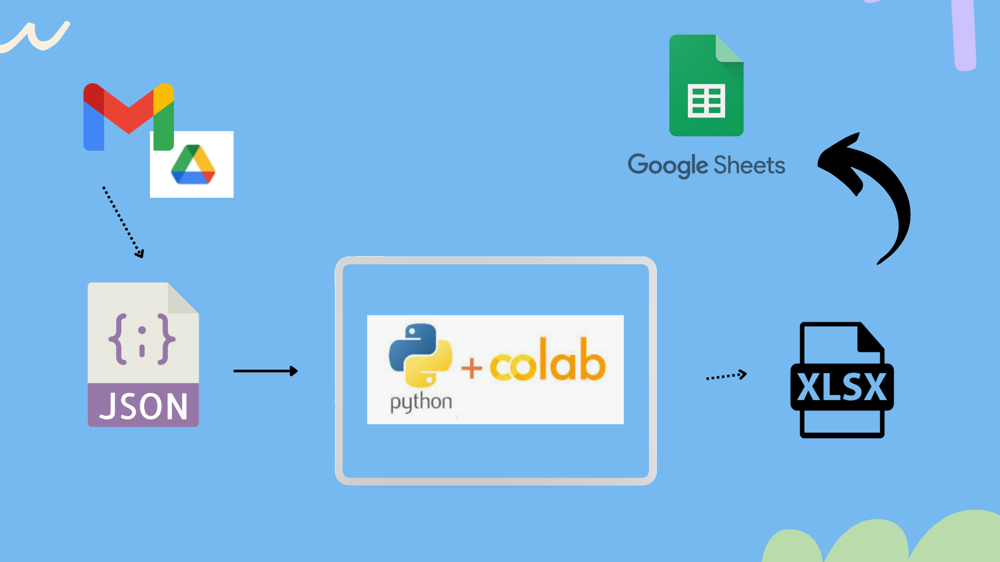

# Desafio Engenheiro de Dados Jr. 

- [Desafio Engenheiro de Dados Jr](#desafio-engenheiro-de-dados-jr)
  - [Informação do Candidato](#informação-do-candidato)
- [Sobre o Desafio](#sobre-o-desafio)
  - [Considerações do Candidato](#considerações-do-candidato)
  - [Arquitetura da proposta](#arquitetura-da-proposta)
  - [Discussão de Arquitetura](#discussão-de-arquitetura)
   - [Modelagem de dados](#modelagem-de-dados)
   - [Arquivo JSON](#arquivo-json)
   - [Google Sheets](#google-sheets)

## Informação do Candidato

| Proprietária        | Contato de e-mail         |
|---------------------|---------------------------|
| Nayara Bernardo     | nayyarabernardo@gmail.com |

## Sobre o Desafio

### Considerações do Candidato 

Seguindo as diretrizes do desafio que foi solicitado no email

Foi criado uma solução para enviar estes dados para uma planilha no Google Sheets

Além disso, compartilhar o arquivo Git junto com o Sheets final e pôr no repositório os arquivos da automação;

### Arquitetura da proposta

IMAGEM DECOMO VOU FAZER

### Discussão de Arquitetura

#### Modelagem de dados

O conjunto de dados é de uma base de clientes. Ele contém name, phone, email, address, postalZip, region, country, list, numberrange, currency do usuário.

#### Arquivo JSON

.json é um arquivo que contém uma série de dados estruturados em formato texto e é utilizado para transferir informações entre sistemas. É uma notação para a transferência de dados que segue um padrão específico. Por isso, pode ser amplamente utilizada em diferentes linguagens de programação e sistemas.

Os dados contidos em um arquivo no formato JSON devem ser estruturados por meio de uma coleção de pares com nome e valor ou ser uma lista ordenada de valores. Seus elementos devem conter:

chave: corresponde ao identificador do conteúdo. Por isso, deve ser uma string delimitada por aspas;
valor: representa o conteúdo correspondente e pode conter os seguintes tipos de dados: string, array, object, number, boolean ou null.

#### Google Sheets

O Script do Google Apps permite que você faça coisas novas e interessantes com o Google Sheets. Ele também permite escrever funções personalizadas para o Planilhas, além de integrar o Planilhas a outros serviços do Google, como Agenda, Drive e Gmail.
A maioria dos scripts projetados para o Planilhas Google manipula matrizes para interagir com as células, linhas e colunas em uma planilha. 

## Arquivo - Google Planilhas

Teoricamente a maneira mais fácil para fazer essa tranferencia seria por meio dessa API, porem eu tive um problema nessa API que nao consegui infelizmente fazer essa transição por lá pela questão que varias API publucas de ImporteJson tem uma dificuldade quando o arquivo URL nao esta disponivel online e sim por meio link de um repositorio privado no caso o Google Drive. 

O que foi feito nesse projeto foi importar o arquivo por meio do Python e com esse arqui XLSX abir a Google Planilha e fazer importação.

 

